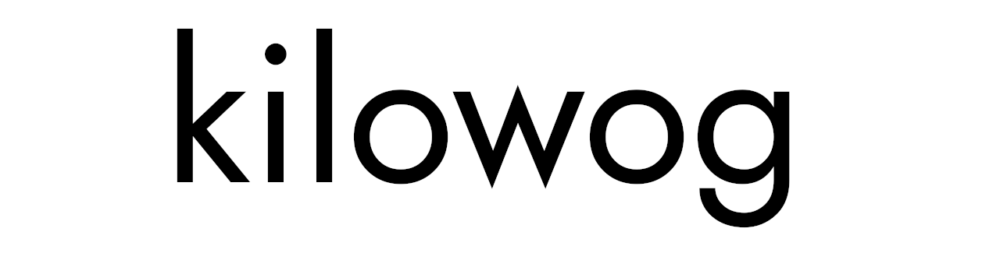
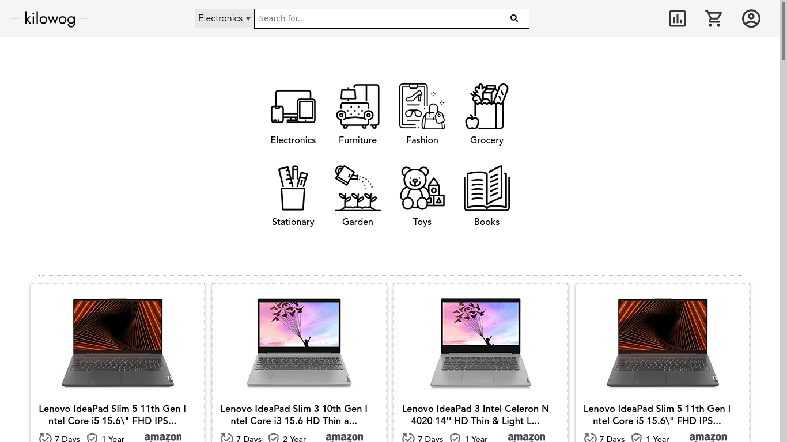
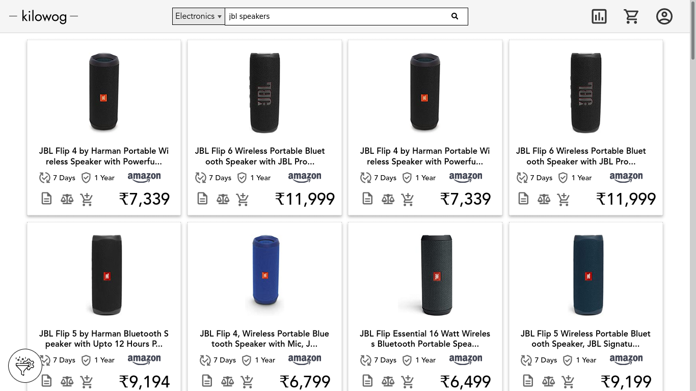
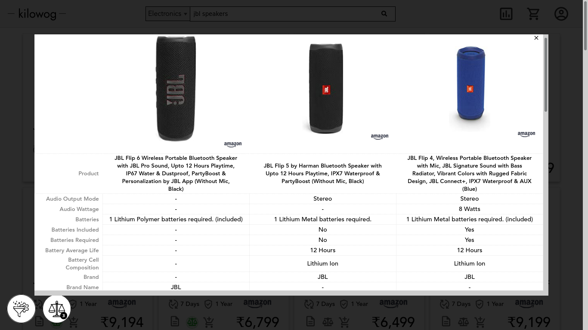

### What is it?

Everyone of us has come across the problem of finding the best possible offering on a product.

Isn't it hard to surf through plethora of online shopping websites just to find the best balance 
between price and services offered(warranty,returns,shipping,etc) while also trying to dodge despicable seller practices(huge discounts = no after-sales services..sound familiar?)

This project aims to solve this exact problem by enhancing on the problem of a standard shopping comparsison website by 
not only offering listings by price but also be able to see the services, specifications, etc. provided by a particular listing.

> TL;DR  A web portal which compares product's prices, specifications, store, services,etc.

> Note: **Kilowog** <u>does not</u> generate a verdict on what is the best product, rather the user is the only
one who decides what product is best for them. **Kilowog** is <u>simply</u> a tool that <u>presents</u> all available <u>information</u>
in a helpful and non-intrusive way to aid the user in making the best choice.

### Features...

- Realtime products from shopping giants(Amazon, Flipkart).
- Filtering Options to trim down your product pool.
- **Comparison Bucket** to compare multiple products by their features side by side.
- Filtering of products by their relevance( <u>WIP</u> ).
- **Deep Fetch** feature that gathers extremely detailed spec sheets related to a product( <u>WIP</u> ).

### When do I get to see it?
Currently **Kilowog** is not hosted anywhere. 
The backend is going through some heavy optimizations and rewrites(mostly getting converted to async).
Once the new backend is brought up to speed, the project will be ready for live deployment.

### Looks..
---

<h5 align="center"> Home Page</h5>

---

<h5 align="center"> Results Page</h5>

---

<h5 align="center"> Compare Bucket</h5>

---

### Technologies..
##### Frontend
- <u>Design</u>: Figma
- <u>UI</u>: React + TypeScript + HTML + CSS
##### Backend
- <u>Server</u>: Actix-Web Server(Rust) 
- <u>Web Scraper</u>(Rust)
- <u>Database</u>(for Recommendations): MongoDB

### Any queries or complaints?
Email me @[Mail](decentboi6969@gmail.com)
